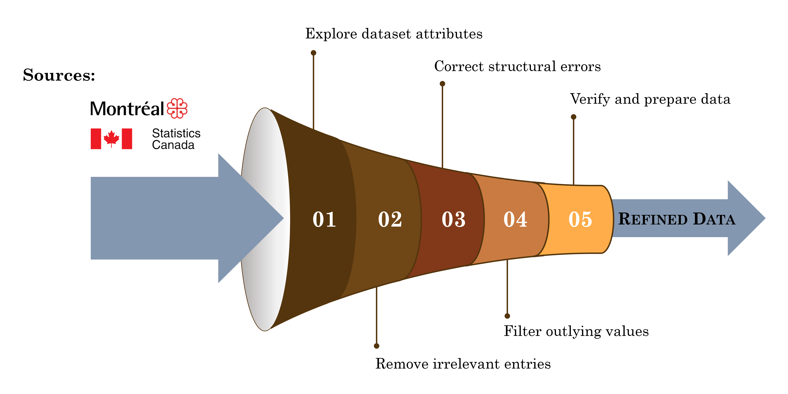
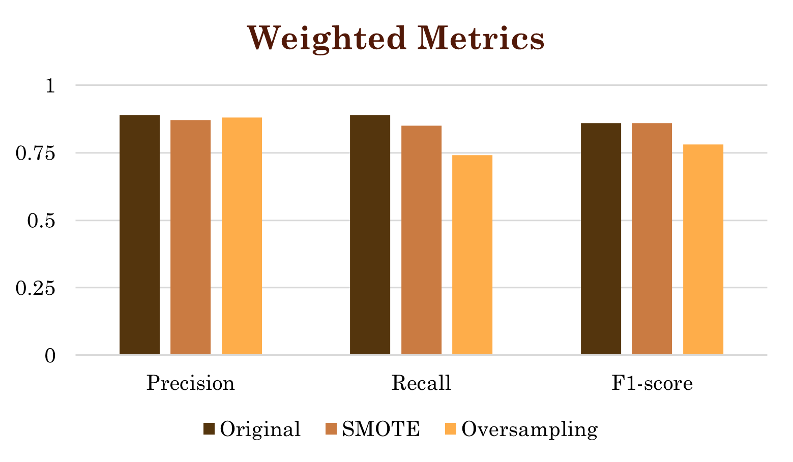

# 🔥 Detailed Technical Overview: Fire Risk Prediction in Montréal

### This document provides a detailed technical overview of the **Fire Risk Prediction in Montréal** project, part of the YCBS 299 Data Science Capstone at McGill University.

### It covers all stages of the project, including:
- Problem formulation and objectives
- Data collection, cleaning, aggregation, and feature engineering
- Modeling strategy, including evaluation metrics and data splits
- Model experimentation and tuning to address class imbalance
- Final model performance results and supporting visualizations
- Business impact analysis and recommendations for deployment

### 🔗 Quick Links:
[🚀 Live App](https://fire-risk-prediction-in-montreal.onrender.com) |
[📖 README](fire-risk-app/README.md) |
[⚙️ Project Details](README-detailed.md) |
[🎞️ Presentation Slides](https://drive.google.com/file/d/1lRE_yKjAF7jHVoCD7S1-z5ezxtrtlUYC/view?usp=sharing)

## 1. 📝 Project Overview
The Montreal Fire Department faces rising fire incidents despite limited staffing and resources. This project **aims to predict monthly high fire-risk areas** using advanced analytics and machine learning, enabling improved resource allocation and preventive strategies that enhance public safety and reduce operational costs.

### Key objectives:
- **🎯 Enhance Response Precision**: Develop a machine learning model capable of accurately predict areas with high fire risk to enable swift strategic response.
- **👷 Optimize Resource Allocation**: Allocate personnel and equipment to high-risk areas effectively.
- **💰 Improve Cost-Efficiency**: Prioritize inspections and reduce preventive measure costs.
- **🧮 Support Budget Planning**: Provide foresight into expenditures for fire incident management.

The data science project directly addresses the critical needs of the Montreal Fire Department. By enhancing the accuracy of fire incident predictions, the model supports better resource deployment and helps protect residents through smarter, data-driven decisions.

👉 **See the [Presentation Slides](https://drive.google.com/file/d/1lRE_yKjAF7jHVoCD7S1-z5ezxtrtlUYC/view?usp=sharing) for a detailed overview of results and impact**

## 2. 🔄 Data Processing

### 2.1 📦 Data Sources
The analysis leveraged diverse datasets spanning January 2005 to January 2024, including:
- **🔥 Fire Incidents** (Open Data - City of Montreal)  
   - Records of fire-related calls, incident types, timestamps, and event locations.
   - Available online: https://donnees.montreal.ca/dataset/interventions-service-securite-incendie-montreal
- **🚒 Fire Station Locations** (Open Data - City of Montreal)  
   - Addresses and coverage details of fire stations.
   - Available online: https://donnees.montreal.ca/dataset/casernes-pompiers
- **🏠 Property Assessments** (Open Data - City of Montreal)  
   - Building attributes (floors, year of construction, surface area).
   - Availalble online: https://donnees.montreal.ca/dataset/unites-evaluation-fonciere 
- **🕵️‍♂️ Crime Statistics** (Open Data - City of Montreal)  
   - Anonymized crime reports with timestamps, locations, and categories.
   - Availalble online: https://donnees.montreal.ca/dataset/actes-criminels
- **🧑‍🤝‍🧑 Census Data** (Open Data - Statistics Canada, 2021)  
   - Demographic and socioeconomic variables (population density, income, dwelling types, etc.).
   - Available online: https://www12.statcan.gc.ca/census-recensement/2021/dp-pd/prof/details/download-telecharger.cfm?Lang=E

### 2.2 🔧 Processing Workflow
We followed a structured, **five-step workflow**, to ensure that all datasets were clean, consistent, and ready for integration into the predictive modeling:

  

  

#### For each grid cell, we aggregated key temporal data sources:

- 🔥 **Monthly Fire incidents** — Total incidents per cell for each month
- 🕵️‍♂️ **Monthly Crime counts** — Aggregated by type and frequency for each month

#### For each grid cell, we aggregated key constant data attributes:
- 🏠 **Building attributes** — Averaged building characteristics (e.g., construction year, floors)  
- 👥 **Census metrics** — Averaged population characteristics (e.g., density, income levels, dwelling types)

### 3.2 🎯Target Class
We defined a **high-risk area** as any grid cell with **2 or more fire incidents in a month**, averaging about 76 high-risk areas citywide per month. This equates to approximately one high-risk grid per fire station per month (68 stations).

- 🔻 **Threshold = 1 fire** would result in ~140 high-risk areas per month
- 🔺 **Threshold = 3 fires** would reduce it to ~30 areas.
- 🎯 The threshold of 2 fires or more was deemed most appropriate for actionable insights.

## 4. 🤖 Model Approach

### 4.1 Objective and Workflow
The modeling approach focused on effectively **predicting high-risk fire areas** through **binary classification**, addressing data challenges and optimizing model performance. 

#### Overall workflow:
- **1️⃣ Establish Baseline Models**: Start with simple models to set performance benchmarks (Dummy Classifier, Decision Tree)
- **2️⃣ Develop and Evaluate Advanced Models**: Build and test more sophisticated models to identify the most promising approach.  
- **3️⃣ Optimize Model Performance**: Enhance the selected model through iterative improvements

### 4.2 🧮 Evaluation Strategy and Metric
Effective prediction means identifying both high-risk and low-risk areas while minimizing misclassifications. Image below indicates consequences of correct and incorrect classification of each class.

- **❗False Negatives:** High-risk areas misclassified as low-risk = risk of delayed response, greater damage, and higher costs

- ⚠️ **False positives:** Low-risk areas misclassified as high-risk = wasted inspections, inefficient use of staff

  

#### We selected:

- **F1-score** as the primary metric to compare different models, addressing the challenge of evaluating classifiers on an imbalanced dataset.

  > This metric **balances precision (avoiding false positives) and recall (minimizing false negatives)**, making it well-suited for the highly imbalanced dataset.

- **High-risk recall** as the key metric during model improvement, given that the high-risk class is smaller but critical to identify accurately.

  > A higher high-risk recall **reduces false negatives**, ensuring the model correctly flags most high-risk areas, which allows proactive intervention and minimizes missed incidents.

- **High-risk precision** as a supporting metric to limit misclassified low-risk areas.

  > A higher high-risk precision **reduces false positives**, that ensures truly predicted high-risk zones and that inspection resources are used efficiently by minimizing unnecessary inspections in low-risk areas

### 4.3 🗂️ Data splitting
**To preserve temporal integrity**, we used a time-based train/test split:

- **Training set: Jan 2011 – Dec 2022**  
- **Test set: Jan 2023 – Dec 2023**

  

## 5. 🏗️Model Development

### 5.1 🧪 Initial Model Comparison
The evaluation of initial models highlighted the performance gap between **simple Decision Tree and Dummy Classifier**, and **advanced methods**, as shown in the accompanying performance metrics:

- **Dummy Classifier** - Baseline F1-score of **0.47**, reflecting its limited predictive capability.  
- **Decision Tree Classifier** - Marginally improved performance with an F1-score of **0.55**.  
- **XGBoost** - Achieved a notable F1-score of **0.63** using basic settings, demonstrating potential  
- **LightGBM** - Delivered comparable performance to XGBoost, with an F1-score of **0.62**.  

>The visualized metrics **underscore XGBoost’s ability to outperform simpler models**, justifying its selection for further optimization to address the fire-risk prediction challenge.

  

### 5.2 🔧 Handling Class Imbalance & XGBoost Tuning

The main challenge affecting the model's predictive accuracy was **significant class imbalance** (~100,000 low-risk vs. ~13,000 high-risk samples). To mitigate this imbalance, **SMOTE** and **Oversampling** balancing techniques were applied to increase the representation of the high-risk class.

#### **🎯 Effect on High-Risk Class Metrics**
- **SMOTE** — modestly improved high-risk recall to **51%**.  
- **Random Oversampling** — significantly improved high-risk recall to **81%**.

  

#### **⚖️ Effect on Weighted Metrics**
- Class balancing techniques do not see almost any influence on weighted metrics.

  

>Based on these results, we selected **XGBoost with Random Oversampling** as the final modeling technique, since it **returns highest recall on the target high-risk class**.

## 6. 🏆 Final Model

### 6.1 🔎 The Final Model Performance

After iterative tuning and significant enhancement, the final **XGBoost model** achieved robust performance tailored to the project’s objectives. The best results on the 2023 test dataset are summarized in the image below.

#### **Key metrics include:**
- 🎯 **High-risk class recall**: 81% — successfully identified most dangerous zones.  

  

### 6.2 🗺️ Prediction Example
The maps below show the distribution of actual fire risk (left) and predicted fire risk (right) for January 2024. These results highlight the effectiveness of the XGBoost model in identifying high-risk areas, supporting resource optimization and fire-risk management across Montreal.

  
  

  <b>Actual Fire Risk (left)</b> &nbsp;&nbsp;&nbsp; <b>Predicted Fire Risk (right)</b>

## 7. 💡 Business Impact and Recommendations
Using January 2024 as an example, the fire-risk prediction model demonstrates significant potential for enhancing fire prevention strategies in Montreal, enabling impactful operational and cost-saving benefits:  

- **🔥 High-Risk Prediction Accuracy** - The model predicted **98 high-risk events**, of which **72 were correctly identified**, showcasing its ability to highlight critical areas for intervention.  
- **💰 Estimated Cost Savings** - The correct predictions of the high fire risk incidents could save approximately **$1.8 million per month** (based on average insurance coverage of $25,000 per fire incident)
- **🟢 Low-Risk Predictions** - Identified **583 low-risk events**, creating an opportunity for focused preventive inspections to proactively reduce fire incidents.  
- **👷 Optimized Resource Allocation** - Proactive inspections and targeted interventions decrease staff workload, allowing more targeted and effective service delivery.  
- **📈 Potential Trends and Focus Zones** - The model reveals zones with consistently elevated fire risk, enabling long term refinement of preventive strategies and resource optimization.  

> These results underscore the model’s ability to improve public safety while offering actionable recommendations to guide future fire prevention initiatives in Montréal.

## 8. 📝 Conclusion

This project demonstrates how **data-driven approaches** can **improve fire prevention** and **resource allocation** in Montreal. By integrating datasets such as fire incidents, crime statistics, property assessments, and census data into a structured 1 km² grid system, a predictive model was developed to identify high fire-risk areas. 

The model achieved **81% recall in predicting high-risk zones**, supporting proactive interventions and operational efficiency. These insights have the potential to **save** approximately **$1.8 million per month** by focusing resources where they are most needed.

Advanced **XGBoost** modelling technique, along with **Random Oversampling** class balancing method, **enhanced prediction reliability**. Future enhancements could include dynamic data integration (e.g., fire inspection records, updated census data) to improve precision further.

This project provides a scalable, data-driven framework for smarter fire prevention, better resource management and public safety, **demonstrating the value of predictive modeling in urban management**.