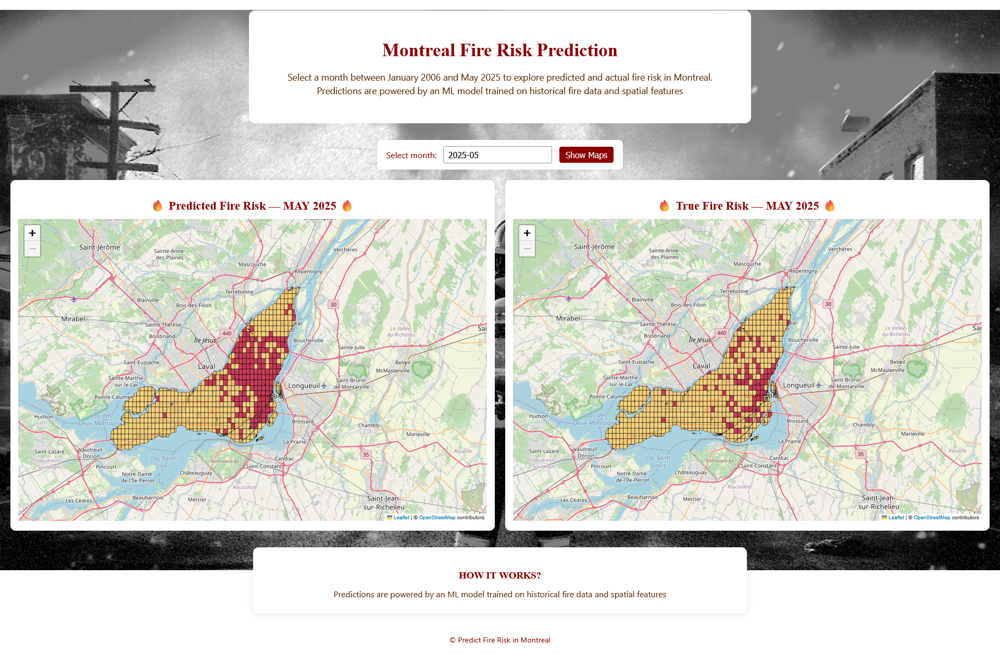
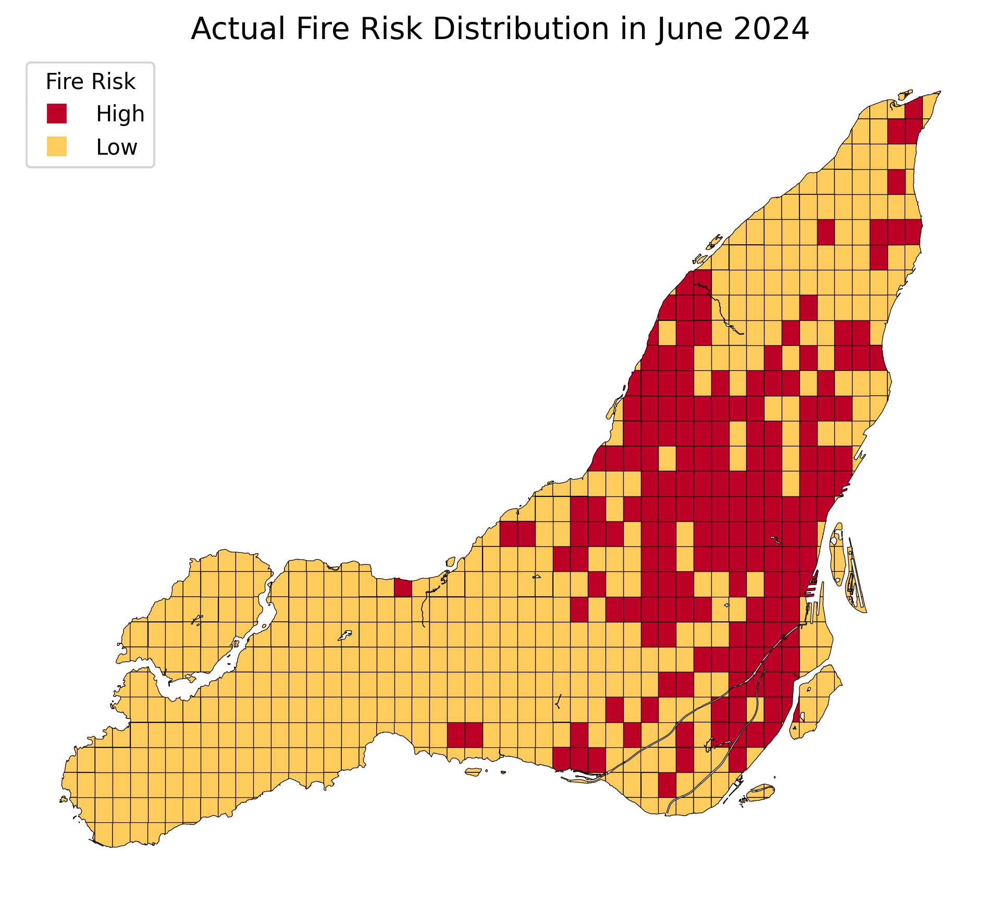
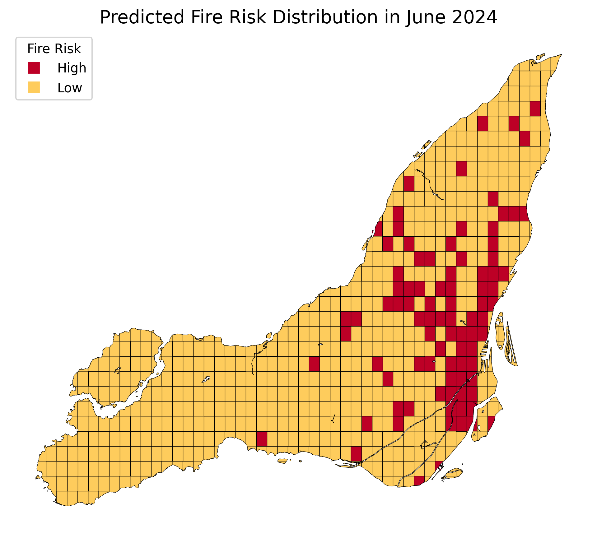

# Fire Risk Prediction in Montreal

### Stop fires and improve public safety in Montreal using machine learning to predict high fire-risk areas!

## 🛠️ Built With
[](https://render.com)
[](https://www.python.org)
[](https://flask.palletsprojects.com/)
[](https://pandas.pydata.org/)
[](https://xgboost.readthedocs.io/)
[](https://scikit-learn.org/)
[](https://geopandas.org/)
[](https://python-visualization.github.io/folium/)
[](https://cloud.google.com/storage)
[](https://git-scm.com/)


## 🔥 Live App
[](https://fire-risk-prediction-in-montreal.onrender.com) 

>An interactive web application accompanies this project to showcase the model in action:

- 📍 View predicted high-risk fire zones across Montreal on an interactive map
- 🕑 Explore fire-risk trends over time
- 🔥 Compare predicted high-risk zones vs actual historical fire incidents  
- ⚡ Demonstrate real-world deployment of a machine learning model

<p align="center">
  
</p>


## 📍 Project Overview  

### 1️⃣ Problem

- The Montreal Fire Department faces a **growing number of fire incidents** while operating with **limited inspectors and crews**.  
- Officials need to know **in advance which neighbourhood grids are most likely to ignite**.  
- A data-driven solution is required to enable **smarter resource allocation, proactive inspections, and improved public safety**.


### 2️⃣  Solution

- 📊 **Data-driven model:** Trained on incidents, property data, crime, census records  
- 🏆 **XGBoost model:** 81% recall on the critical high-risk class  
- 🗺️ **Interactive web app:** Live map lets users map predictions, scroll through monthly trends, and compare against historical fires (👉[Try the App](https://fire-risk-prediction-in-montreal.onrender.com))

👉 **See the [Project Details](fire-risk-app/README-detailed.md) for a deep dive into the solution and methodology**


### 3️⃣ Impact

- 💰 **~$1.8M/month** potential savings by targeting preventive actions
- 👷 Reduced workload through efficient resource allocation
- 🛡️ Improved public safety by proactively addressing fire risk zones

👉 **See the [Presentation Slides](https://drive.google.com/file/d/1lRE_yKjAF7jHVoCD7S1-z5ezxtrtlUYC/view?usp=sharing) for a detailed overview of results and impact**

### 🔗 Quick Links
[🔥 Live App](https://fire-risk-prediction-in-montreal.onrender.com) |
[📖 Project Details](fire-risk-app/README-detailed.md) |
[⚙️ Deployment Guide](fire-risk-app/README-deployment.md) |
[🎞️ Presentation Slides](https://drive.google.com/file/d/1lRE_yKjAF7jHVoCD7S1-z5ezxtrtlUYC/view?usp=sharing)

## 🔧 Modeling Summary

- 📊 **Task:** Binary classification of high-risk (≥ 2 fires/month) and low-risk grid cells  
- 🧠 **Models evaluated:** XGBoost, Decision Tree, LightGBM, HistGradientBoosting  
- 🏆 **Best model:** XGBoost + Oversampling → 81% recall on high-risk areas  
- 🎯 **Key metric:** Prioritized recall on high-risk zones to minimize missed events  
- 📅 **January 2024 result:** 72 of 98 actual high-risk events correctly predicted
- 💾 **Model size:** ~500 KB; compact and efficient for web deployment  


## 🔎 Visual Example

>Actual vs predicted high-risk areas, **January 2024**

<p align="center">
  
  
</p>

<p align="center"><b>Left:</b> Actual incidents &nbsp;&nbsp;|&nbsp;&nbsp; <b>Right:</b> Model predictions</p>


## ⚙️ Technical Insights

- 🔄 **Monthly prediction pipeline** — Automatically generates and displays fire-risk forecasts for the upcoming month  
- ☁️ **Google Cloud Storage** — External storage for the model and feature data, supporting lightweight and scalable deployment  
- 🎯 **XGBoost model** — Lightweight, fast, and accurate (81% recall on high-risk areas); ideal for real-time web deployment  
- 🧮 **GeoPandas + Folium** — Handles geospatial analysis and interactive map rendering  
- 🛠️ **Flask API** — Serves predictions and map layers through a lightweight web interface  


## 🚀 Deployment

>This project is fully deployed as a live, cloud-based web application:

- ☁️ **Render:** Production hosting for the Flask web app  
- 📦 **Google Cloud Storage:** Application data and model storage for scalable serving  
- 🔧 **GitHub Repository:** Source code hosted and integrated with Render for automated deployment

👉 **See the [Deployment Guide](fire-risk-app/README-deployment.md) for details on how to reproduce this deployment** 


## 📦 Data Sources
>This project leverages diverse, real-world datasets covering nearly 20 years (2005–2025), sourced from open government open data portals:

- 🔥 Fire incidents: [Open Data - City of Montreal](https://donnees.montreal.ca/dataset/interventions-service-securite-incendie-montreal)
- 🚒 Fire station locations: [Open Data - City of Montreal](https://donnees.montreal.ca/dataset/casernes-pompiers)
- 🏠 Property assessments: [Open Data - City of Montreal](https://donnees.montreal.ca/dataset/unites-evaluation-fonciere)
- 🕵️‍♂️ Crime statistics: [Open Data - City of Montreal](https://donnees.montreal.ca/dataset/actes-criminels)
- 🧑‍🤝‍🧑 Census data (2021): [Open Data - Statistics Canada](https://www12.statcan.gc.ca/census-recensement/2021/dp-pd/prof/details/download-telecharger.cfm?Lang=E)


## 📂 Project Structure
```
Fire-Risk-Prediction-in-Montreal/
├── fire-risk-app/              # Flask web app
│   ├── src/                    # Python blueprints, routes, utils
│   ├── templates/              # Jinja2 HTML templates
│   ├── static/                 # HTML maps and jpg images used by the app
│   ├── model/                  # Saved model
│   ├── data/                   # Fire risk history data and spatial grid
│   ├── app.py                  # Main entry-point (local)
│   ├── README-app.md           # App-specific setup notes
│   └── requirements-app.txt    # App-only dependencies
│
├── notebooks/                  # Jupyter notebooks (worflow testing, modelling)
│
├── setup_scripts/              # Shell helpers (env, GCS link, etc.)
│   ├── create_venv.sh
│   ├── activate_venv.sh
│   └── link_gcs_with_key.sh
│
├── files/                      # Non-code assets committed to Git
│   └── images/                 # README screenshots & figures
│
├── requirements-dev.txt        # Core project dependencies
├── README.md                   # Main documentation (overview, demo link)
├── README-detailed.md          # Deep-dive technical write-up
└── .gitignore                  # Ignore venvs, secrets, pycache, etc.

```

## 📄 License

This project is licensed under the MIT License — see the [LICENSE](LICENSE) file for details.