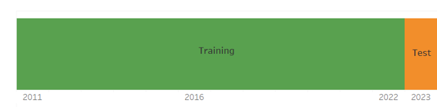
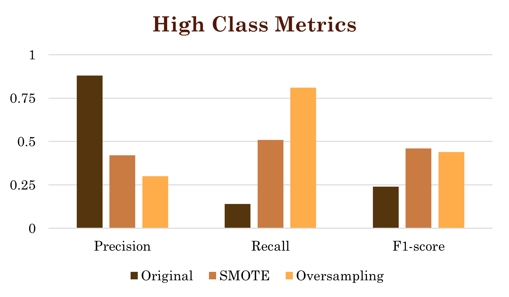
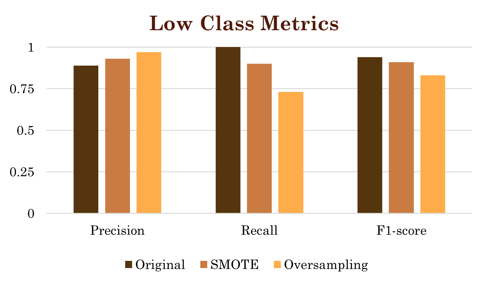
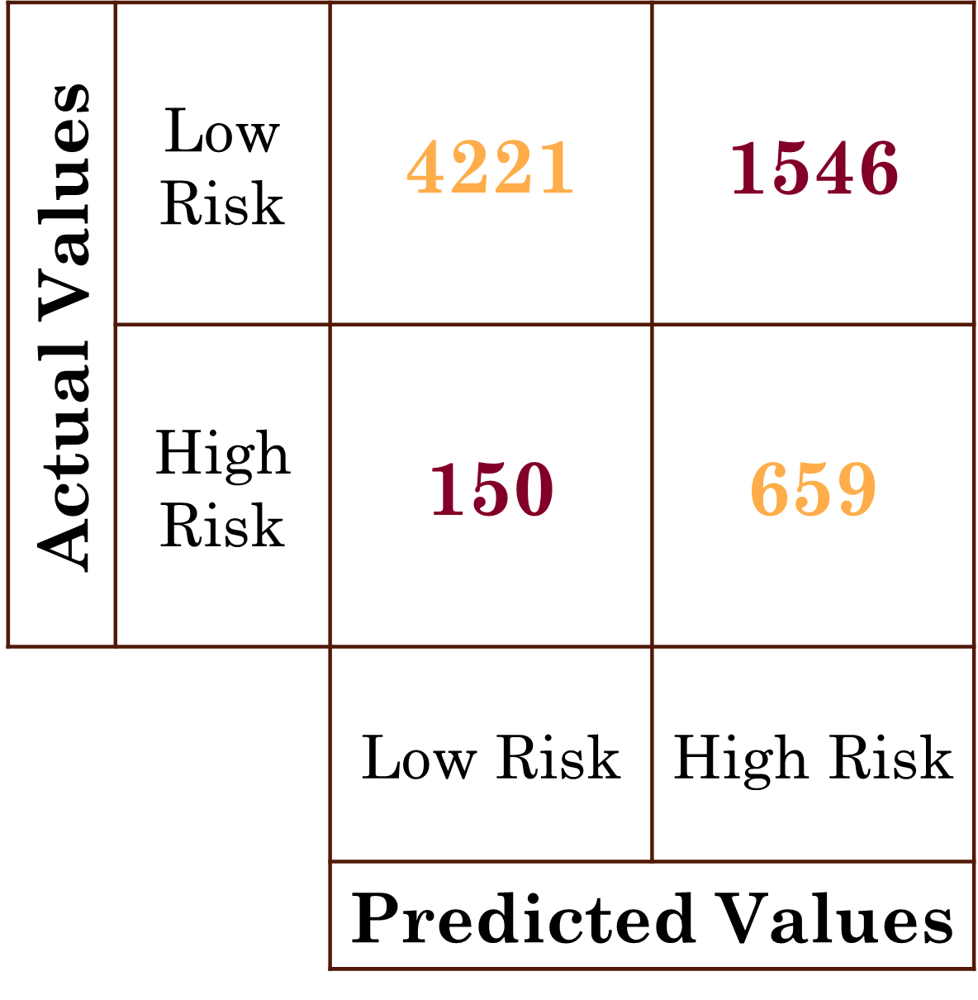

# Prediction of High Fire Risk Areas in Montreal
[](https://fire-risk-prediction-in-montreal.onrender.com)

This repository contains the work for the **YCBS 299 - Data Science Capstone Project** course at McGill University conducted in 2024 by Team #6: Felix MARTINEZ MEJIAS, Sienko IKHABI, Vladislav YUSHKEVICH, Vadim STRELNIKOV.

## Project Overview
The Montreal Fire Department faces rising fire incidents despite limited staffing and resources. This project aims to **predict monthly high fire-risk areas** using advanced analytics and machine learning, enabling improved resource allocation and preemptive strategies that enhance public safety and reduce operational costs.

Key objectives:
- **Enhance Response Precision**: Develop a machine learning model capable of accurately predict areas with high fire risk to enable swift strategic response.
- **Optimize Resource Allocation**: Allocate personnel and equipment to high-risk areas effectively.
- **Improve Cost-Efficiency**: Prioritize inspections and reduce preventive measure costs.
- **Support Budget Planning**: Provide foresight into expenditures for fire incident management.

The data science project directly addresses the critical needs of the Montreal Fire Department, aligning with goals of efficiency, effectiveness, and fiscal responsibility. By enhancing the accuracy of fire incident predictions, the model optimizes resource deployment and bolsters the city's firefighting capabilities, ultimately contributing to the safety and well-being of its residents.

## Deployment
A deployment guide is provided for reproducing the cloud-based deployment.
See [Deployment Guide](fire-risk-app/README-deployment.md) for full instructions.
The deployed application is available live on [Render](https://your-render-app-url).
  
## Data Sources
The analysis leveraged diverse datasets spanning January 2005 to January 2024, including:
- **Fire Incidents** (Open Data - City of Montreal)  
   - Records of fire-related calls, incident types, timestamps, and event locations.
   - Avaialble online: https://donnees.montreal.ca/dataset/interventions-service-securite-incendie-montreal
- **Fire Station Locations** (Open Data - City of Montreal)  
   - Addresses and coverage details of fire stations.
   - Available online: https://donnees.montreal.ca/dataset/casernes-pompiers
- **Property Assessments** (Open Data - City of Montreal)  
   - Building attributes (floors, year of construction, surface area).
   - Avaialble online: https://donnees.montreal.ca/dataset/unites-evaluation-fonciere 
- **Crime Statistics** (Open Data - City of Montreal)  
   - Anonymized crime reports with timestamps, locations, and categories.
   - Avaialble online: https://donnees.montreal.ca/dataset/actes-criminels
- **Census Data** (Open Data - Statistics Canada, 2021)  
   - Demographic and socioeconomic variables (population density, income, dwelling types, etc.).
   - Available online: https://www12.statcan.gc.ca/census-recensement/2021/dp-pd/prof/details/download-telecharger.cfm?Lang=E

## Data Exploration and Refinment

### Process Overview
The data exploration and refinement process was guided by a structured approach ensuring that the datasets were comprehensive, consistent, and ready to be used for the development of the predictive model. This phase involved 5 pivotal steps, as illustrated by the data refinement funnel below.


1. **Attribute Analysis**: The attributes of each dataset were thoroughly examined to identify relevant insights and determine the necessary actions for meaningful feature extraction.

2. **Removal of Irrelevant Entries**: Redundant and unnecessary data entries were filtered to maintain focus and reduce noise, ensuring a targeted and effective analysis.

3. **Correction of Structural Errors**: Structural inconsistencies and errors were identified and rectified to prevent skewed results, ensuring that the datasets were properly aligned and formatted.

4. **Outlier Filtering and Missing Data Handling**: Outlier values were removed to maintain consistency across datasets, while missing data was addressed through appropriate methods, enhancing the comprehensiveness and reliability of the analysis.

5. **Data Verification and Preparation**: The refined datasets were verified for completeness, consistency, and alignment with project objectives, ensuring readiness for integration into the modeling pipeline.

### Insights and Trends Identified

#### Fire Incidents:  
  - Non-residential fires ("AUTREFEU") occurred predominantly on weekends and peaked during summer months, with a decline in recent years.  
  - Residential fires ("INCENDIE") showed a consistent pattern, slightly increasing in recent years and also peaking on weekends.  

#### Property Assessments:  
  - Borough assessments varied significantly, averaging **14,752 assessments per borough**, ranging from 74 to 42,241.  
  - Key features identified for modeling include **maximum number of floors**, **year of construction**, **land area**, and **building area**, with proactive outlier removal ensuring data integrity.  

#### Crime Data:  
  - Certain crime types were excluded (e.g., "Theft of a motor vehicle"), as they showed no inherent correlation with fire incidents.  
  - Retained categories like "Break into property" and "Mischief" showed potential correlations with fire incidents.  

#### Census Data:  
  - Variables such as population density, family size, income levels, and dwelling values were identified as potentially influencing fire risks.  
  - For instance, high-density areas may increase electrical line overloads, while income levels and dwelling value may indicate preventive measures or maintenance efforts.

## Feature Engineering

### Data Aggregation
To standardize and align the datasets, Montréal was divided into 685 grid cells, each measuring 1 km², with unique identifiers assigned to each grid cell. This approach facilitated consistent spatial analysis and integration across datasets.


Temporal and constant data features for each grid cell was aggregated, including:
- **Fire Incidents**: Total incidents per grid cell.
- **Crime Counts**: Aggregated by type and frequency.
- **Building Attributes**: Average building characteristics, such as construction year and number of floors.
- **Census Metrics**: Population density, income levels, and dwelling types.

This aggregation process provided a unified structure for all datasets, ensuring a comprehensive view of spatial and temporal trends essential for fire-risk prediction.

### Target Class
High-risk areas were defined as grid cells with 2 or more fire incidents per month, averaging 76 high-risk areas monthly across the city. This equates to approximately one high-risk grid per fire station (68 stations) per month.
- Lowering the threshold to 1 or more fires would result in ~140 high-risk areas per month
- Raising it to 3 or more fires would reduce it to ~30 areas.
- The threshold of 2 fires or more was deemed most appropriate for actionable insights.

## Model Creation

### Modelling Approach Summary
The modeling approach focused on effectively **predicting high-risk fire areas** through **binary classification**, addressing data challanges and optimizing model perfromance. 

#### Modeling Workflow:
- **Establish Baseline Models**: Start with simple models to set performance benchmarks
- **Develop and Evaluate Advanced Models**: Build and test more sophisticated models to identify the most promising approach.  
- **Optimize Model Performance**: Enhance the selected model through iterative improvements

#### Model Evaluation:
Accurately identifying both high-risk and low-risk areas is important for the fire department to proactively allocate resources and conduct inspections. Misclassifications can have significant consequences:

- False Negatives (High-risk areas misclassified as low-risk): Increase the risk of delayed responses to critical incidents, potentially resulting in greater damage, safety hazards, and higher costs.

- False Positives (Low-risk areas misclassified as high-risk): Lead to inefficient resource allocation and unnecessary inspections, resulting in wasted time and effort.


#### Metric:
The **F1-score** was chosen as the general evaluation metric to evaluate and to compare classification capabilities of different models, adressing the challange of accurately classifing both classes. This metric balances precision (avoiding false positives) and recall (minimizing false negatives), making it particularly suitable for the highly imbalanced dataset.

The **high-risk class recall** was prioritized as the **key evaluation metric** during the model improvement stage, given the high-risk class is significantly smaller but more critical to identify accurately. A higher recall indicates fewer false negatives, meaning the model successfully identifies most areas with a potentially high risk of fire. This ensures that critical high-risk zones are accurately flagged for proactive intervention, minimizing the likelihood of missed incidents.

Additionally, a high **low-risk class precision** ensures that a smaller number of high-risk areas are misclassified as low-risk. This aligns closely with the key evaluation metric.

#### Modelling Data Sets: 
The pre-processed and aggregated data was divided into training and test datasets, ensuring a continuous temporal split to account for the time-dependent nature of the data. Specifically, the training dataset included records from January 2011 to December 2022, while the test dataset comprised records from January to December 2023.



### Base Model Results
The evaluation of baseline models highlighted the performance gap between simple and advanced methods, as shown in the accompanying confusion matrices and performance metrics:

- **Dummy Classifier**: Set the baseline with an F1-score of **0.47**, reflecting its limited predictive capability.  
- **Decision Tree Classifier**: Marginally improved performance with an F1-score of **0.55**.  
- **XGBoost**: Achieved a notable F1-score of **0.63** using a basic configuration, demonstrating its potential for handling the classification task.  
- **LightGBM**: Delivered comparable performance to XGBoost, with an F1-score of **0.62**.  

The visualized metrics underscore XGBoost’s ability to outperform simpler models, justifying its selection for further optimization in handling the fire-risk prediction challenge.


### Improvement of XGBoost
The main issue affecting the model's predictive accuracy was the class imbalance. The dataset contained significantly more low-risk examples (~100,517) than high-risk examples (~13,878). To mitigate this imbalance, techniques such as **SMOTE** and **Oversampling** were applied to increase the representation of the high-risk class.

- **SMOTE** improved high-risk recall to **51%**, while **Oversampling** further enhanced it to **81%**.
 

- Class balancing techniques do not see almost any influence on weighted metrics.
 

- **Oversampling** demonstrated highest low-risk precision.


Thus we preferred modeling techniques based on oversampling methods as this method returns highest recall on the target class. 

## Modelling Results

### The Final Model
By systematically fine-tuning the **XGBoost model** through iterative adjustments and rigorous testing, we significantly enhanced its predictive accuracy and performance metrics, and we finally developed a robust and reliable predictive model tailored to the specific requirements of the project. The best performance results on the test dataset for 2023 are summarized in the confusion matrix below. The model achieved:  
- **81% accuracy in predicting High-Risk regions**
- **73% accuracy in predicting Low-Risk regions**


### Example of Usage
The visual distribution of actual fire risk (left image) versus predicted fire risk (right image) for January 2024 is also displayed. These results highlight the effectiveness of the XGBoost model in identifying high-risk areas, aiding in resource optimization and improving fire-risk management strategies across Montréal.

<p align="center">
  
  
</p>

<p align="center">
  <b>Actual Fire Risk (left)</b> &nbsp;&nbsp;&nbsp; <b>Predicted Fire Risk (right)</b>
</p>

## Business Impact and Recommendations
Using January 2024 as an example, the fire-risk prediction model demonstrates significant potential for enhancing fire prevention strategies in Montréal, enabling impactful operational and cost-saving benefits:  

- **High-Risk Prediction Accuracy**: The model predicted **98 high-risk events** for January 2024, of which **72 were correctly identified**, showcasing its ability to highlight critical areas for intervention.  
- **Cost Savings**: The correct predictions of the high fire risk incidents could save approximately **$1.8 million per month**, based on an average insurance coverage of **$25,000 per fire incident**.
- **Low-Risk Predictions**: Identified **583 low-risk events**, creating an opportunity for focused preventive inspections to proactively reduce fire incidents.  
- **Efficient Resource Allocation**: Proactive inspections and targeted interventions decrease staff workload, allowing for better resource reallocation and enhanced service delivery.  
- **Potential Trends and Focus Zones**: The model offers insights into recurring high-risk areas, enabling data-driven refinement of preventive strategies and resource optimization.  

These results underscore the model’s ability to improve public safety while offering actionable recommendations to guide future fire prevention initiatives in Montréal.

## Conclusion

This project demonstrates how data-driven approaches can improve fire prevention and resource allocation in Montréal. By integrating datasets such as fire incidents, crime statistics, property assessments, and census data into a structured 1 km² grid system, a predictive model was developed to identify high fire-risk areas. The model achieved 81% accuracy in predicting high-risk zones and 73% for low-risk areas, supporting proactive interventions and operational efficiency. These insights have the potential to save approximately $1.8 million per month through targeted inspections and preventive measures.

Advanced modeling techniques, like XGBoost, and class balancing strategies enhanced prediction reliability. Future improvements could include incorporating dynamic data sources, such as fire inspection records and updated census data, to further optimize accuracy.

This project provides a scalable framework for data-driven fire prevention, enabling better resource management and public safety while showcasing the transformative potential of predictive analytics in urban planning.

## Presentation
A summary presentation of this project is available [here](https://drive.google.com/file/d/1lRE_yKjAF7jHVoCD7S1-z5ezxtrtlUYC/view?usp=sharing).

## ~~Project Organization~~
```
├── project-name/
│   ├── notebooks/
│   │   ├── data_exploration.ipynb
│   │   ├── model_training.ipynb
│   ├── scripts/
│   │   ├── data_preprocessing.py
│   │   ├── model.py
│   │   ├── train.py
│   ├── results/
│   │   ├── figures/
│   │   │   ├── confusion_matrix.png
│   │   │   ├── accuracy_plot.png
│   │   ├── metrics.txt
│   ├── environment.yml (or requirements.txt)
│   ├── LICENSE
│   ├── README.md
│   └── .gitignore
```
## ~~Tools and Techniques~~

- **Data Cleaning and Processing**: Alteryx, Google Cloud BigQuery.
- **Model Development**: Python, Jupyter Notebooks, libraries such as XGBoost.
- **Visualization**: Tableau, Excel for impactful storytelling.
- **Advanced Methods**: SMOTE and Oversampling techniques to address class imbalance.
